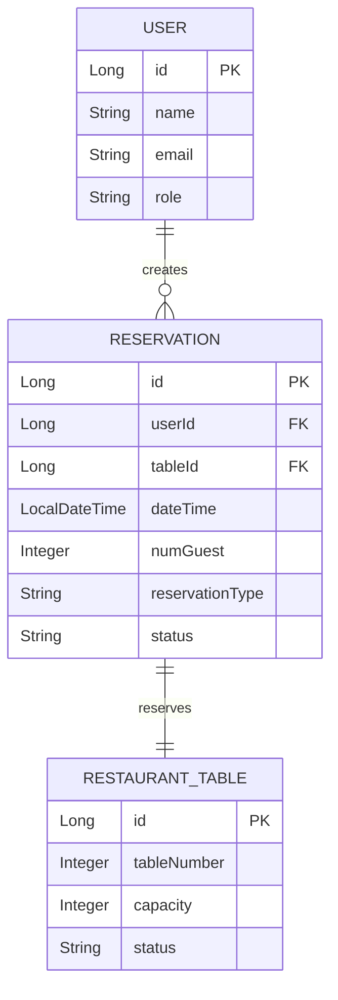

# 🍽️ Reserva de Restaurantes
## 📖 Sobre o Projeto

**Reservas De Restaurantes** é uma API REST robusta desenvolvida em **Spring Boot** para gerenciamento completo de reservas em restaurantes. O sistema oferece controle de mesas, usuários, autenticação JWT e operações CRUD completas para reservas.

<div align="center">

[](https://openjdk.org/)
[](https://spring.io/projects/spring-boot)
[](https://maven.apache.org/)
[](https://jwt.io/)

</div>

---


### Principais funcionalidades

- **Autenticação JWT** com controle de roles (ADMINISTRADOR/CLIENTE)
- **Sistema de Reservas Completo**
    - Criar reservas (tipos SIMPLE e EXECUTIVE)
    - Listar todas as reservas
    - Cancelar reservas 
    - Deletar reservas por nome do usuário
- **Gerenciamento de Mesas**
    - Controle automático de status (DISPONÍVEL/RESERVADA)
    - Validação de capacidade
    - Operações CRUD completas
- **Arquitetura MVC** bem estruturada
- **Documentação Swagger/OpenAPI** integrada
- **Validação automática** de disponibilidade de mesas
- **Segurança baseada em roles** para operações administrativas

---

## Tecnologias utilizadas 

<table>
<tr>
<td align="center" width="96">

<br>Java 17+
</td>
<td align="center" width="96">

<br>Spring Boot
</td>
<td align="center" width="96">

<br>Maven
</td>
<td align="center" width="96">

<br>PostgreSQL
</td>
<td align="center" width="96">

<br>REST API
</td>
</tr>
</table>

### Principais Dependências
- **Spring Security** - Autenticação e autorização JWT
- **Spring Data JPA** - Persistência e ORM
- **SpringDoc OpenAPI** - Documentação automática da API
- **PostgreSQL** - Banco em memória para desenvolvimento
- **Bean Validation** - Validação de dados de entrada

---

## Como executar

### Pré-requisitos

```bash
☑️ Java 17 ou superior
☑️ Maven 3.6+
☑️ PostgreSQL instalado e configurado
☑️ Git
```

### Instalação e Execução

```bash
# 1️⃣ Clone o repositório
git clone https://github.com/CesaoW/Gerenciamento-de-Reservas.git
cd Gerenciamento-de-Reservas

# 2️⃣ Configure o banco PostgreSQL
# Crie um banco de dados chamado 'reservas' no PostgreSQL
# Configure as credenciais no application.properties

# 3️⃣ Instale as dependências
mvn clean install

# 4️⃣ Execute a aplicação
mvn spring-boot:run
```

### Acessos

| Serviço | URL | Descrição |
|---------|-----|-----------|
| **API Base** | `http://localhost:8080` | Servidor principal |
| **Swagger UI** | `http://localhost:8080/swagger-ui.html` | Interface de documentação |
| **API Docs** | `http://localhost:8080/v3/api-docs` | Especificação OpenAPI |

---

## Exemplos de Uso

### Gerenciamento de Usuários

```bash
# Login para obter token JWT
curl -X POST http://localhost:8080/user/login \
  -H "Content-Type: application/json" \
  -d '{
    "name": "admin",
    "password": "admin123"
  }'
```

### Gerenciamento de Reservas

```bash
# Criar nova reserva
curl -X POST http://localhost:8080/reservas \
  -H "Content-Type: application/json" \
  -d '{
    "userName": "João Silva",
    "numGuest": 4,
    "dateTime": "2024-08-15T19:30:00",
    "reservationType": "SIMPLE"
  }'

# Listar todas as reservas
curl -X GET http://localhost:8080/reservas \

# Cancelar reserva
curl -X PATCH http://localhost:8080/reservas/cancel \
  -H "Content-Type: application/json" \
  -d '{
    "userName": "João Silva",
    "dateTime": "2024-08-15T19:30:00"
  }'

# Deletar reserva (remove permanentemente)
curl -X DELETE http://localhost:8080/reservas/João Silva \
  -H "Authorization: Bearer {seu-jwt-token}"
```

### Gerenciamento de Mesas (Apenas Administradores)

```bash
# Criar nova mesa
curl -X POST http://localhost:8080/mesas \
  -H "Authorization: Bearer {admin-jwt-token}" \
  -H "Content-Type: application/json" \
  -d '{
    "tableNumber": 10,
    "capacity": 4,
    "status": "DISPONIVEL"
  }'
```

---

## Arquitetura do Projeto

```
src/main/java/
├── controller/           # Endpoints REST
│   ├── ReservationController
│   ├── MesaController
│   └── UserController
├── dto/                 # Data Transfer Objects
│   │   ├── ReservationDTO
│   │   ├── RestTableDTO
│   │   └── UserDTO
├── model/               # Entidades JPA
│   ├── Reservation
│   ├── RestaurantTable
│   └── User
├── repository/          # Acesso aos dados
│   ├── ReservationRepository
│   ├── RestTableRepository
│   └── UserRepository
├── security/            # Configurações de Segurança
│   │   ├── JwtRequestFilter
│   │   ├── JwtUtil
│   │   └── SecurityConfig
├── service/             # Lógica de negócio
│   ├── ReservationService
│   ├── MesaService
│   └── UserService
└──       
```

---

## Modelo de Dados



---

## Sistema de Autenticação

### Roles Disponíveis

| Role | Permissões |
|------|------------|
| **ADMINISTRADOR** | ✅ Todas as operações em mesas e reservas |
| **CLIENTE** | ✅ Criar e gerenciar suas próprias reservas |

### Endpoints Protegidos

- `POST /mesas` - Apenas ADMINISTRADOR
- `PATCH /mesas` - Apenas ADMINISTRADOR
- `DELETE /mesas` - Apenas ADMINISTRADOR
- `DELETE /reservas/{userName}` - Autenticação obrigatória
- `PATCH /reservas/cancel` - Autenticação obrigatória

---

---

## Desenvolvedor

<div align="center">

**César Nogueira**

[](https://github.com/CesaoW)
[](https://www.linkedin.com/in/c%C3%A9sar-rodrigues-46b944238/](https://www.linkedin.com/in/roberto-de-morais-junior-461148373/))
[](mailto:cesarnogueirarodrigues1200@gmail.com)

</div>

---

<div align="center">

⭐ **Se este projeto foi útil para você, considere dar uma estrela!** ⭐

**Feito com ❤️ e ☕ por [César Nogueira](https://github.com/CesaoW)**

</div>
